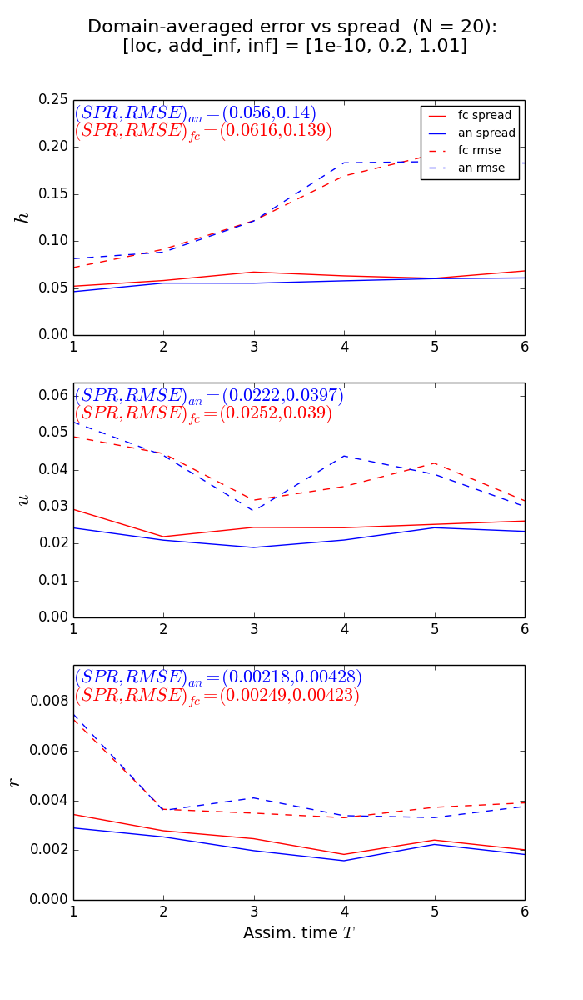
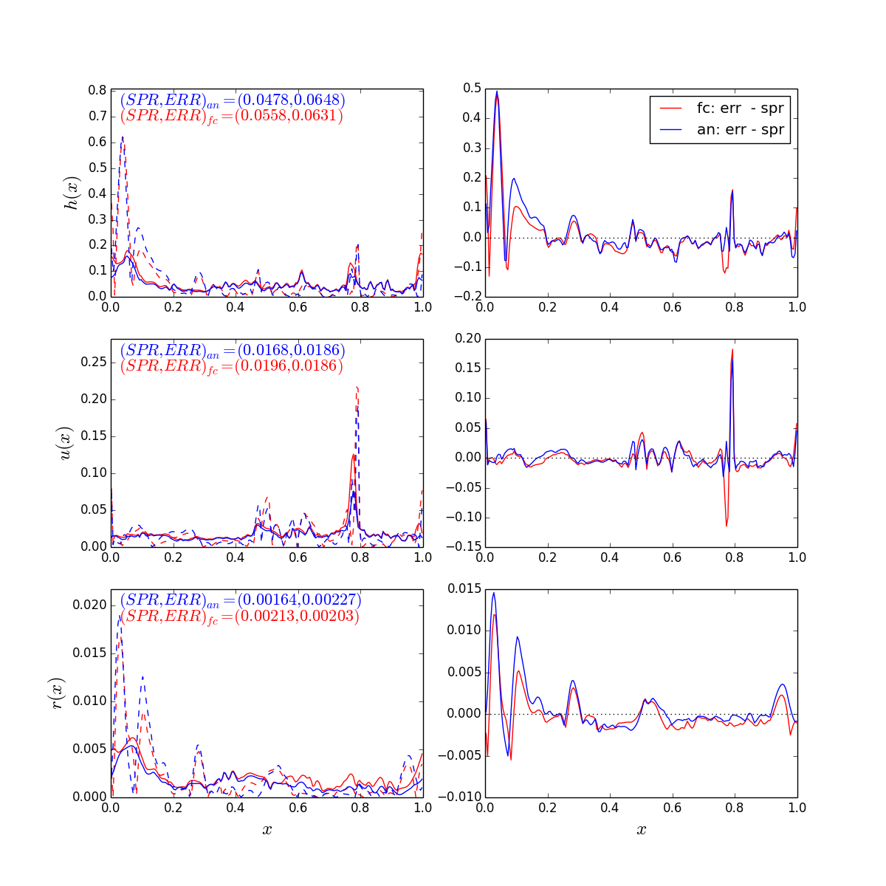
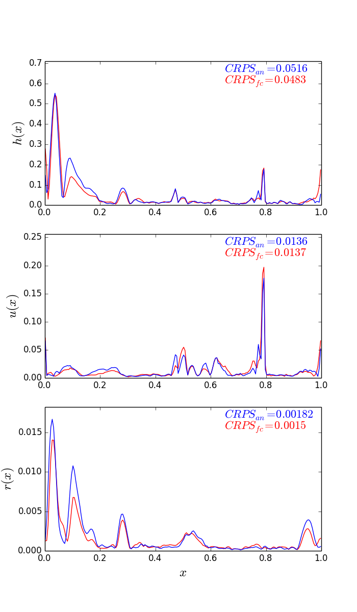

# modRSW_EnKF
## An idealised convective-scale forecast-assimilation framework

This repository aims to facilitate the transfer of knowledge and continued use of a basic convective-scale forecast-assimilation system developed during TK's PhD (Kent 2016). The forecast component comes from an idealised fluid model of convective-scale Numerical Weather Prediction (modRSW; Kent et al. 2017) and the assimilation algorithm is the perturbed-observation Ensemble Kalman Filter (EnKF). The following document should contain sufficient instruction for users to download, implement and adapt the source code, which briefly comprises Python scripts for the numerical solver, idealised forecast-assimilation routines, plotting and data analysis.

***CAVEAT: this is not a black-box model and should accordingly be used with care and curiosity!***

How to get started with the source code and files is outlined below. A brief overview of each file is given and there are some model-only and forecast-assimilation test cases to check things are up and running properly. Further details, including what should be modified in the scripts for different experimental set-ups, are given in the test cases.

***NOTE FOR (POTENTIAL) USERS (Aug 2018): improvements to the assimilation algorithm are currently being developed offline; git update expected here during 2019 -- in the meantime, everything still works fine!***

## Background
Numerical Weather Prediction (NWP) can be thought of as initial value problem comprising a forecast model and suitable initial conditions, with its accuracy depending critically on both. Data Assimilation (DA) attempts to provide the optimal initial conditions for the forecast model by estimating the state of the atmosphere and its uncertainty using a combination of forecast and observational information whilst taking into account their respective uncertainties. Optimality of the initial state is crucial in such a highly nonlinear system with limited predictability, and the forecast models need regular reinitialisation to prevent divergence from the true solution.

In particular, DA techniques need to evolve in order to keep up with the developments in convection-permitting NWP models. To aid understanding of and facilitate research into highly complex forecast-assimilation systems, computationally inexpensive ‘idealised’ models can be employed that embody some essential features of these systems. Kent et al. (2017) have developed on such idealised fluid model that combines the nonlinearity of the rotating shallow water equations (SWEs) with switches for the initiation of convection and precipitation. It modifies the SWEs to include some simplified dynamics of cumulus convection, including rapid ascent and descent of air, and the transport of moisture.

Data assimilation research using idealised models is primarily carried out in a so–called 'twin' experiment setting, whereby the same computational model is used to generate a 'nature' run (which acts as a surrogate truth) and the forecasts. If the forecasts are generated using exactly the same model integration as the nature run, the resulting DA experiments are said to be carried out in a perfect model setting. On the other hand, in an imperfect model scenario, forecasts are generated using a different model configuration, e.g., with misspecified model parameters or at a coarser spatial resolution. The nature run is a single long integration of the numerical model and is a proxy for the true evolving physical system. It is the principal difference between idealised and operational DA experiments and its function is twofold. First, it is used to produce pseudo-observations of the physical system, which are then assimilated into the forecast model. These pseudo-observations (also known as synthetic observations) are generated by applying the observation operator to the state vector from the nature run and adding random samples from a specified observational error distribution. Second, it provides a verifying state with which to compare the forecast and analysis estimates and thus quantify the errors in each.

One example of a potential configuration of the model and assimilation algorithm using this framework is detailed in chapter 6 of Kent (2016), and provides the basis for the source code available here.

## References
* Kent, T. (2016) An idealised fluid model of Numerical Weather Prediction: dynamics and data assimilation. *PhD thesis, University of Leeds*. Available at [http://etheses.whiterose.ac.uk/17269/](http://etheses.whiterose.ac.uk/17269/).

* Kent, T., Bokhove, O., Tobias, S.M. (2017): Dynamics of an idealized fluid model for investigating convective-scale data assimilation. *Tellus A: Dynamic Meteorology and Oceanography*, 69(1), 1369332. [DOI](https://doi.org/10.1080/16000870.2017.1369332).
----

## Getting started
### Versions
All of the source code is written in Python and relies heavily on the numpy module, amongst others. The plotting routines require matplotlib. The versions used in this development are tabled below. Other versions may work, but should not be relied upon.

Software      | Version
------------- | -------------
Python  | 2.7.7
Matplotlib  | 1.3.1
Numpy  | 1.8.1

To check python version, from the terminal:
```
python --version
```

To check numpy version, open python in the terminal, import it and use the version attribute:
```
>>> import numpy
>>> numpy.__version__
```
Same for Matplotlib.

### Download and install

Clone from terminal (recommended):
* Go to the directory where you want to save the repository and use the command:
```
git clone https://github.com/tkent198/modRSW_EnKF.git
```
* Once downloaded, to get any updates/upgrades to the original clone, use the command:
```
git pull https://github.com/tkent198/modRSW_EnKF.git
```

Direct download:
* click on the download link on the repository homepage [https://github.com/tkent198/modRSW_EnKF](https://github.com/tkent198/modRSW_EnKF) and save to desired directory.

### Running the code: basics
To run a script (e.g., `fname.py`) from the terminal, ```cd``` to the ```modRSW_EnKF``` directory and enter the command:
```
python fname.py
```

To kill at any point, press ```Ctrl+c```, or kill the active processes using ```top``` from the terminal.


## Brief overview of files

```parameters.py```: List of all parameters pertaining to the model itself and the forecast-assimilation framework.

### Model only

```run_modRSW.py```: Runs modRSW with no assimilation, plotting at given intervals. Use to check model-only dynamics.

```init_cond_modRSW.py```: Functions for different initial conditions, detailed within.

```f_modRSW.py```: Functions required for the numerical integration of the modRSW model with and without topography.
* ```make_grid()```           : generates mesh for given length and number of elements
* ```NCPflux_topog()```       : calculates numerical flux as per the theory of Kent et al., 2017
* ```time_step()```           : calculates stable time step for integration
* ```step_forward_topog()```  : integrates forward one time step (forward euler) using NCP-Audusse
* ```heaviside()```           : vector-aware implementation of heaviside (also works for scalars

### Assimilation framework

```main_p.py```: main run script for idealised forecast-assimilation experiments
* specifies outer loop parameters, generates truth , make relevant directory `dirname` etc., and ...
* Enter EnKF outer loop using ```subr_enkf_modRSW_p.py```


```create_readme.py```: function creates readme.txt file for summarising experiments, saved in `dirname` to accompany outputted data from main run script and EnKF subroutine.


```subr_enkf_modRSW_p.py```: Subroutine accessed by ```main_p``` for performing EnKF given outer-loop parameters in ```main_p```

```f_enkf_modRSW.py```: Collection of functions related to the assimilation specifically, incl.:
* ```generate_truth()```      : simulates truth trajectory at given resolution and stores run at given observing times.
* ```analysis_step_enkf()```  : performs perturbed obs. enkf analysis step, returns updated ensemble and output data for saving.
* ```analysis_step_enkf_v2()```  : same as above, but with additive inflation applied AFTER assimilation.
* ```gaspcohn()```           : Gaspari-Cohn taper function for ensemble localisation.
* ```gaspcohn_matrix()```: construct localisation matrix based on ```gaspcohn``` function

```localisation.py```: Initial investigations and calculation of localisation taper function and matrices using ```gasp_cohn```.

```model_error_Q.py```: Initial investigations of additive inflation and model error, incl Q matrix computation and sampling

### Plotting and data analysis

```plot_truth.py```: A few checks on characteristics of the nature run: plot all trajectories, e.g., check height and rain extremes.

```plot_func_x.py```: Plotting routine: loads saved data in specific directories and produces domain plots at a given assimilation time. To use, specify (1) `dir_name`, (2) combination of parameters `ijk`, (3) time level ```T = time_vec[ii]```, i.e., choose ```ii```.

```plot_func_t.py```: Produces domain-averaged error, CPRS, and OI plots as a function of time.  To use, specify (1) `dir_name`, (2) combination of parameters `ijk`.

```analysis_diag_stats.py```: > ave_stats: function calculates summary statistics `DIAGS.npy` for each experiment `ijk` in given `dirname` and returns averaged spread, error, crps, OI for forecast and analysis ensembles.

```compare_stats.py```: Each directory has i*j*k experiments with different parameter combinations. This script looops through ave_stats `ijk` and plots 2d summary matrix a la Poterjoy and Zhang for comparison. If `DIAGS.npy` exists, straight to plotting. If not, calculate statistics and save before plotting.

```crps_calc_fun.py```: Function: calculate the CRPS of an on ensemble of forecast variables following the theory of Hersbach (2000), and as applied in Bowler et al (2016) and DAESR5.

```run_modRSW_EFS.py```: Script runs ensemble forecasts of length Tfc, initialised from analysed ensembles at a given time T0. Saves forecasts as `X_EFS_array_Tn.npy` for n = T0, to be used e.g. to calculate error growth statistics.

```EFS_stats.py```: Computes and plots error growth, crps for the EFS data produced in ```run_modRSW_EFS.py```. Also computes and saves error doubling times, to be used in ```err_doub_hist```.

```err_doub_hist.py```: Plots error doubling time histograms from saved data ```err_doub_Tn.npy```.

### .npy data

```Q_offline.npy```: a static Q matrix for additive inflation, generated in ```offlineQ.py```.

```Q_large.npy```: a static Q matrix for additive inflation, generated in ```offlineQ.py```.

## Test cases

### 1. Model only: integration and dynamics

Given a computational mesh, model parameters, and an initial condition and specified boundary conditions, the model can be integrated to a specified finite time. The ```run_modRSW.py``` script achieves this, using functions from ```f_modRSW.py```, initial conditions from ```init_cond_modRSW.py``` and parameters from ```parameters.py```, plotting the variables at given times.

***NOTE: the model integrates the flux variables [h,hu,hr]; for plotting, and later DA, we use [h,u,r].***

The default model parameters are:

Name | Parameter      | Values
------------- | ------------- | -------------
Rossby | Ro  | Inf
Froude | Fr  | 1.1
Base height | H0  | 1.0
Threshold c | Hc  | 1.02
Threshold r | Hr  | 1.05
beta | beta | 0.2
alpha | alpha | 10
c2 | c2  | 0.1Hr/(Fr)^2

In  ```run_modRSW.py```, the user can specify the resolution ```Nk```, initial condition ```ic```, and the number of "hours" to integrate ```Nmeas```. The script then integrates the initial condition from ```tn=0``` to ```tmax``` and saves figures of the plotted ```Nmeas``` solutions in the created directory  ```cwd/test_model```.

Default setting:

Name | Parameters    | Values
------------- | ------------- | -------------
No. of elements | Nk  | 200
No. of cycles | Nmeas  | 6
Init. cond. | ic  | init_cond_topog_cos
Boundary cond. | BC | 1

NOTE on BCs: there are currently three options for boundary conditions, as follows.

BC | Type    | Notes
------------- | ------------- | -------------
1 | Periodic  | -
2 | Outflow  | Neumann (zero derivative at x = 0 and L)
3 | Specified inflow  | Dirichlet at x=0, outlow at x = L

For BC = 3: currently set up to specify hu(0,t) -- see ```step_forward_topog``` in ```f_modRSW.py```.

To run this from the terminal:
```
python run_modRSW.py
```

First, the initial condition is generated and a figure saved in  ```cwd/test_model```. Then the integration starts and figures and simulation data are saved in  ```cwd/test_model``` at the given times. This should be clear from the text that is printed to the terminal. When ```tmax``` is reached, the integration stops and a summary of the simulation is printed to the terminal. Just above the summary on the terminal, the maximum value of h(x) at time t=0.288 is given; verify that the same numerical value is obtained:
```
CHECK data value: maximum h(x) at t = 0.288: 1.70591737156  at x =  0.8875
```

Also check the saved figures in the directory ```test_model```. Compare with the figure below (```t2_Nk200```), and note the maximum h value and its location, as given above.


In idealised forecast-assimilation experiments, it is typical to use a finer resolution to generate the nature run, constituting an 'imperfect' twin experiment (see Background above). To see the impact on the solution of integrating at a finer resolution, open the ```run_modRSW.py``` script and change the number of elements to ```Nk = 800```. After saving, run the script again:
```
python run_modRSW.py
```
This simulation will take longer since the smaller grid-length requires a smaller time step for stability. As before, verify that the same numerical value for the height variable is obtained:
```
CHECK data value: maximum h(x) at t = 0.288: 2.15336146511  at x =  0.888125
```
Also check the saved figures, and compare with the figure below (```t2_Nk800```), again noting the maximum h value.


Typically (and as done in the idealised DA experiments), simulation data is saved and subsequently used to generate plots in separate 'offline' plotting routines.  The routine ```plot_test_model.py``` shows how to load the saved data and plot multiple subplots. This also gives a better comparison between the two simulations. To run from the terminal:
```
python plot_test_model.py
```
This plots four figures (for the four times the data is saved) and saves them in the same directory ```test_model```. Verify that the following figure is produced (```t2_compare```):


In the idealised DA experiments outlined here, the Nk=200 simulation represents the forecast and the Nk=800 simulation is the nature run. This figure shows an example trajectory of both forecast and nature at a given time: h (top), u (middle), and r (bottom) from the forecast model (left) and the nature run (right). The forecast trajectory is smoother and exhibits 'under-resolved' convection and precipitation while the nature run has sharper 'resolved' features and is a proxy for the truth. The thick black line in the top panels is the topography, the red dotted lines are the threshold heights.

Conceptually, the basic data assimilation problem can be summarised using this figure: adjust the forecast (left) using pseudo-observations (generated by noisy samples of the nature run) in order to provide a better estimate of the nature run (right).

### 2. Idealised forecast-assimilation experiments

#### Running an experiment

The main run program for idealised forecast-assimilation experiments is ```main_p.py```. Its workhorse is the subroutine function ```run_enkf()``` in the ```subr_enkf_modRSW_p```, which carries out each experiment, i.e., the ensemble forecasts and analysis steps for the given outer loop parameters. The combination of outer loop parameters define a single experiment.

The default model parameters are (see ```parameters.py```):

Name | Parameter      | Values
------------- | ------------- | -------------
Rossby | Ro  | Inf
Froude | Fr  | 1.1
Rest height | H0  | 1.0
Threshold c | Hc  | 1.02
Threshold r | Hr  | 1.05
beta | beta | 0.2
alpha | alpha | 10
c2 | c2  | 0.1Hr/(Fr)^2

The default parameters for this test assimilation are:

Name | Parameter      | Values
------------- | ------------- | ------------
No. of elements | Nk_fc | 200
Mesh refinement factor | dres  | 4  
Ensemble size | n_ens  | 20
No. of cycles | Nmeas  | 3
IC noise | sig_ic | [0.05,0.05,0.0]   
Obs. noise | ob_noise | [0.1,0.05,0.005]
Obs. density | o_d | 50

The outer loop parameters are specified in ```main_p.py```:

Name | Parameter      | Values
------------- | ------------- | -------------
Localisation scale | loc  | 1e-10
Add. inflation | add_inf  | 0.2
Mult. inflation | inf  | [1.01, 1.05, 1.1]

The observing system here is direct, i.e., the observation operator is linear: all variables are observed every ```o_d``` elements in forecast space. So, in the case with ```Nk_fc = 200```, each variable is observed in 4 equally spaced locations, yielding 12 observations in total.

The purpose of this test case is to check that the cycled system is up and running, including the saving of data and readmes to automatically-generated directories. Once this has been verified, the outer loop and assimilation parameters can be extended (e.g., more combinations in the table above, longer runs with, e.g., ```Nmeas = 48``` ).

To run from the terminal:
```
python main_p.py
```
Text is printed to the terminal throughout to provide information and updates on its progress.

First, the nature run is generated and saved as this is the same for all experiments. If it already exists, it is loaded instead. Once this is complete, the routine enters the EnKF outer loop, comprising ```Nmeas``` 'forecast' and 'analysis' steps. The ensemble forecasts are integrated in parallel using the ```multiprocessing``` module. This is set to use half of the total number of CPU cores and can be modified depending on the user's machine. When all forecasts reach the time for assimilation, the ensembles are passed to the analysis step routine. Here, pseudo-observations are generated from the nature run and assimilated using the EnKF, producing the analysis ensemble and passing back for the next cycle to start.

After looping through all parameter combinations, a brief summary is printed to the terminal and the program ends. To check the saved data and readmes, enter the relevant directory:
```
cd test_enkf
```
Here, there should be 2 data files for the nature run, ```U_tr_array.npy``` and ```B_tr.npy```, and more subdirectories for each experiment. The subdirectories are suffixed with digits ```ijk``` denoting each experiment, e.g., ```test_enkf111``` refers to experiment ```[loc, add_inf, inf] = [1e-10, 0.2, 1.01]```. Each subdirectory has data saved from this particular experiment (see table below) and a ```readme.txt``` summarising this experiment.

Filename | Type | Content
------------- | ------------- | -------------
B | .npy  | Topography
X_tr_array | .npy | Nature run
Y_obs_array | .npy | Observations
OI | .npy | Obs. influence diagnostic
X_array | .npy | Forecast ('prior') ens.
Xan_array | .npy | Analysis ('posterior') ens.
readme | .txt | Summary

Check:

```
cd test_enkf111
ls -l
more readme.txt
```

Now the data has been saved, we can move on to plotting and data analysis...

***NOTE: the model integrates the flux variables U=[h,hu,hr] but assimilates X=[h,u,r]. Hence, the forecast and analysis trajectories are in terms of X.***

#### Plotting

There are numerous diagnostics and metrics for interpreting ensemble-based forecast-assimilation systems and their relevance to the NWP problem. Here, the focus is on ensemble spread, error, the continuous ranked probability score (CRPS), and the observational influence diagnostic (OID)  - see chapter 5 (specifically section 5.6) in Kent (2016) for definitions, details, and relevant references.

There are two main plotting routines:

  * ```plot_func_t.py```: produces *domain-averaged* spread vs. error, CPRS, and OI plots as a function of time.  To use, specify (1) `dir_name`, (2) combination of parameters `ijk`.
  * ```plot_func_x.py```: produces domain plots at a given assimilation time. To use, specify (1) `dir_name`, (2) combination of parameters `ijk`, (3) time level ```T = time_vec[ii]```, i.e., choose ```ii```.

Both routines load the saved data generated in `main_p.py` from specific directories, which must be manually specified. In this case, `dirname` is `test_enkf` and the default `ijk` is `111`.  Three plots are saved in an automatically-generated figure directory `cwd/test_enkf/test_enkf111/figs/`.

##### 1. Using `plot_func_t.py`

To run the plotting routine, enter in the terminal:
```
python plot_func_t.py
```
When complete, check the plots are been created:
```
ls -l test_enkf/test_enkf111/figs/
```
and verify them with the figures below. Time-averaged values for each metric are printed in the figure corner. To generate the same plots for different experiments, open the script and specify a different `ijk' combination.

***NOTE: statistics will vary slightly as each experiment uses a stochastically-generated ensemble of model trajectories and observations.***

###### Observational Influence diagnostic

The OID provides a measure of the overall impact of observations/forecast on the analysis estimate. In operational NWP, most weight comes from the forecast (approx. 80% for global NWP). Observations are too few and incomplete (compared to the size of the system) to provide a comprehensive picture of the state. As such, observations adjust the more comprehensive forecast estimate closer to reality, rather than replace it completely. The OID of an idealised framework should reflect this; as a guiding figure, it should not be lower than 10% or higher than 50%. The OID is calculated at each assimilation time. In this test case, there are 3 cycles so we have 3 OID values. The plot title shows the number of ensembles `N` and the outer loop parameter combination:


###### Spread vs. Error

A well-configured ensemble (i.e., sufficiently spread) is crucial to providing an adequate estimation of forecast error, and consequently an optimal analysis estimate. Thus, the RMSE of the ensemble mean should be comparable to the ensemble spread. These statistics are calculated at each grid point and then domain-averaged, yielding a single value for the forecast ensemble and analysis ensemble at each assimilation time.



###### CRPS

The CRPS verifies the reliability of an ensemble with lower scores indicating higher
skill. As such, the analysis ensemble should have a lower CRPS than the forecast ensemble valid at the same time.


***NOTE: this is a test case, not a well-tuned experiment! See chapter 6 (specifically figs. 6.8 and 6.9) of Kent (2016) for an example of a well-tuned experiment with comparable spread and error, reasonable OID and CRPS.***


##### 2. Using `plot_func_x.py`

This routine produces plots as a function of space *at a given assimilation time*. Thus, in addition to the `dirname` and `ijk` combination, the user must specify the time ```T = time_vec[ii]```, i.e., choose ```ii```. The default setting is `ii=3`.

Enter in the terminal:
```
python plot_func_x.py
```

When complete, check the plots are been created:
```
ls -l test_enkf/test_enkf111/figs/
```
and verify with the figures below...

Afterwards, try changing the cycle number (e.g., `ii=2`) and experiment `ijk` by specifying the values in the script.

###### Ensemble trajectories and observations

As well as the spread vs. error and CRPS statistics, it is useful to look at the dynamical situation at the specified time and how the ensembles and observations reflect this. The figure `T3_assim.png` illustrates this:


Ensemble trajectories (blue) and their mean (red for forecast; cyan for analysis), pseudo-observations (green circles with corresponding error bars), and nature run (green solid line) after 3 hours/cycles (hence `T=3`). Left column: forecast ensemble (i.e., prior distribution, before assimilation); right column: analysis ensemble (i.e., posterior distribution, after assimilation).


###### Spread vs. Error

The figure `T3_spr_err.png` plots the ensemble spread and RMSE of the ensemble mean for each variable as a function of x (left column). Generally, the ensemble exhibits larger spread in regions of convection where the errors are largest (around x=0.05 here). The right column
of plots the difference between the error and spread.



Left column: error (dashed) and spread (solid) as a function of x at T=3. Domain-averaged values are given in the top-left corner. Right column: the difference between the error and spread. Positive (negative) values indicate under- (over-) spread.

###### CRPS

The CRPS is calculated for each variable at each grid point at the given time (see section 5.6.3 in Kent (2016)) and plotted as a function of space in figure `T3_crps.png`:



CRPS as a function of x at T=36: forecast (red) and analysis (blue) ensemble.
Generally, the ensembles are less reliable (higher CRPS values) in regions of convection and precipitation (again, around x=0.05 here). Domain-averaged values are given in the top-right corner.

***NOTE AGAIN: this is a test case, not a well-tuned experiment! See chapter 6 (specifically figs. 6.10-6.12) of Kent (2016) for an example of a well-tuned experiment with comparable spread and error, reasonable OID and CRPS.***

## Adapting the code
